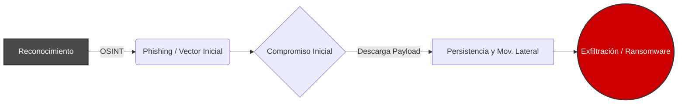

# Cybersecurity Threat Landscape 2026

**Autor:** Angel Miguel Sevillano Cespedes  
**Rol Objetivo:** SOC Analyst / Blue Team Specialist

---

## Introducción
El panorama de amenazas cibernéticas es el entorno dinámico donde convergen vulnerabilidades tecnológicas, motivaciones de actores maliciosos y vectores de ataque emergentes. En 2026, la sofisticación de los ataques requiere que las organizaciones adopten enfoques de inteligencia de amenazas proactivos. Este proyecto documenta las principales amenazas, tácticas y herramientas de defensa modernas.

## Objetivos del Proyecto
* Analizar los vectores de ataque más críticos proyectados para 2026.
* Desglosar el ciclo de vida de un ciberataque desde el reconocimiento hasta el impacto.
* Documentar herramientas estándar de la industria utilizadas en centros de operaciones de seguridad.

## Amenazas Principales en 2026
* **Ransomware:** Evolución hacia la doble y triple extorsión.
* **Phishing:** Campañas hiperpersonalizadas.
* **Malware:** Códigos maliciosos sin archivos (fileless) que residen en la memoria RAM.
* **Ingeniería Social:** Uso de deepfakes de voz y video.
* **Ataques a la nube:** Explotación de configuraciones deficientes.
* **Vulnerabilidades Zero-Day:** Explotación de fallos de seguridad desconocidos por el fabricante.

## Conceptos Fundamentales
* **SOC (Security Operations Center):** Equipo centralizado que monitorea, detecta y responde a incidentes 24/7.
* **SIEM:** Sistemas que agregan y analizan registros de múltiples fuentes para detectar anomalías.
* **Threat Intelligence:** Análisis de información sobre actores de amenazas (TTPs).
* **Incident Response:** Enfoque estructurado para gestionar las secuelas de una brecha.

## Ciclo de Ataque Moderno

## Conclusiones y Recomendaciones
La defensa perimetral tradicional es insuficiente. Se recomienda:
1. Implementar marcos de trabajo sólidos como un SGSI alineado a ISO 27001.
2. Adoptar arquitecturas Zero Trust (Confianza Cero).
3. Fortalecer la seguridad del terminal mediante plataformas XDR.