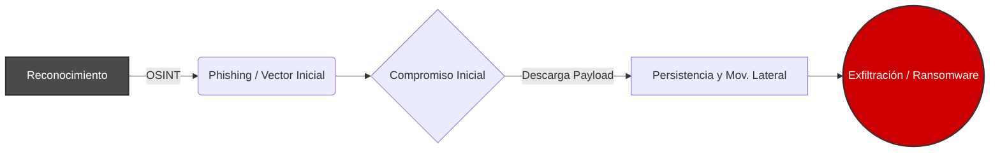
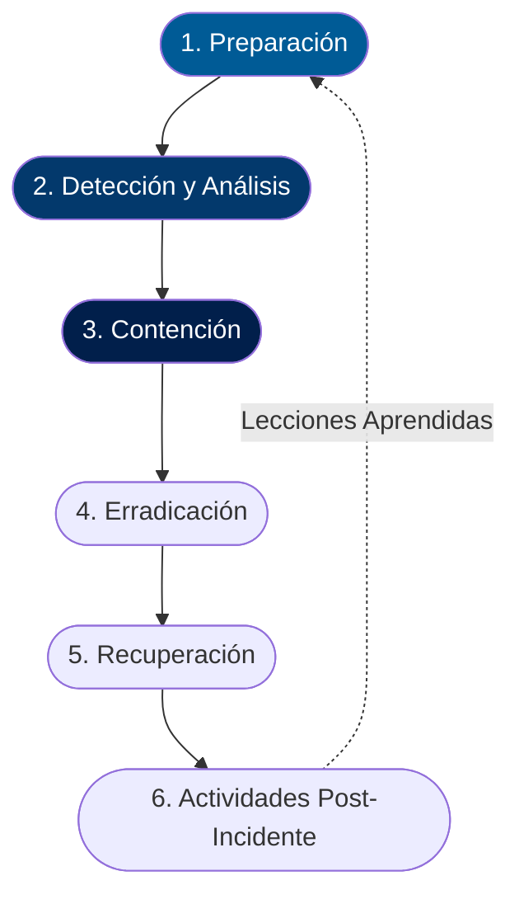

# Cybersecurity Threat Landscape 2026

**Autor:** Angel Miguel Sevillano Cespedes  
**Rol Objetivo:** SOC Analyst / Blue Team / Cyber Threat Intelligence

---

## 🌍 Introducción
El panorama de amenazas cibernéticas es el entorno dinámico donde convergen vulnerabilidades tecnológicas, motivaciones de actores maliciosos y vectores de ataque emergentes. En 2026, la sofisticación de los ataques requiere que las organizaciones no solo reaccionen, sino que adopten enfoques proactivos. Este proyecto documenta las principales amenazas, tácticas y herramientas de defensa modernas.

## 🎯 Objetivos del Proyecto
* Analizar los vectores de ataque más críticos proyectados para 2026.
* Desglosar el ciclo de vida de un ciberataque y los flujos de respuesta.
* Documentar herramientas estándar de la industria utilizadas en Centros de Operaciones de Seguridad (SOC).

## ⚠️ Amenazas Principales en 2026
* **Ransomware:** Evolución hacia la doble y triple extorsión.
* **Phishing:** Campañas hiperpersonalizadas impulsadas por IA.
* **Malware:** Códigos maliciosos sin archivos (fileless) en memoria RAM.
* **Ingeniería Social:** Manipulación mediante deepfakes de voz y video.
* **Ataques a la Nube:** Explotación de configuraciones deficientes.
* **Vulnerabilidades Zero-Day:** Explotación de fallos antes del parcheo.

## 🛡️ Conceptos Fundamentales
* **SOC (Security Operations Center):** Equipo centralizado responsable de monitorear, detectar y responder a incidentes 24/7.
* **SIEM:** Sistemas que agregan y analizan logs para detectar anomalías.
* **Threat Intelligence:** Recopilación y análisis de TTPs de atacantes.
* **Incident Response:** Enfoque estructurado para gestionar brechas de seguridad.

## 🔄 Ciclo de Ataque Moderno (Attack Chain)

## 🚨 Flujo de Respuesta a Incidentes (NIST)

## 🧰 Herramientas de Defensa (SOC Stack)
| Herramienta | Categoría | Uso Principal | Caso de Uso en SOC |
| :--- | :--- | :--- | :--- |
| **Splunk** | SIEM | Agregación y análisis de logs | Correlación de eventos para detectar movimientos laterales. |
| **Microsoft Sentinel** | SIEM / SOAR | Análisis y orquestación cloud | Detección de inicios de sesión anómalos y bloqueo automático. |
| **Microsoft Defender** | XDR | Protección integral del terminal | Prevención de ejecución de macros maliciosas. |
| **Wireshark** | Análisis de Red | Captura de paquetes (PCAP) | Inspección de tráfico para identificar exfiltración. |
| **Nmap** | Escaneo de Red | Descubrimiento de hosts y puertos | Verificación de puertos abiertos no autorizados. |
| **CrowdStrike** | EDR | Monitoreo avanzado de procesos | Aislamiento de terminales infectados. |

## 💼 Skills Demonstrated
Este proyecto evidencia competencias prácticas aplicables a entornos corporativos:
* **Network Security:** Comprensión de topologías y análisis de tráfico.
* **Cloud Infrastructure & Data:** Visión de seguridad aplicada a arquitecturas en la nube.
* **Security Operations:** Diseño de flujos de análisis de alertas (L1/L2) y metodologías estructuradas (PICERL).
* **Threat Analysis:** Comprensión de vectores de ataque modernos (Ransomware, Zero-Day).

## 📌 Conclusiones
La defensa perimetral tradicional es insuficiente. Las organizaciones deben adoptar una mentalidad de "brecha asumida", implementando arquitecturas Zero Trust, fortaleciendo la visibilidad mediante XDR y automatizando la respuesta con plataformas de análisis.